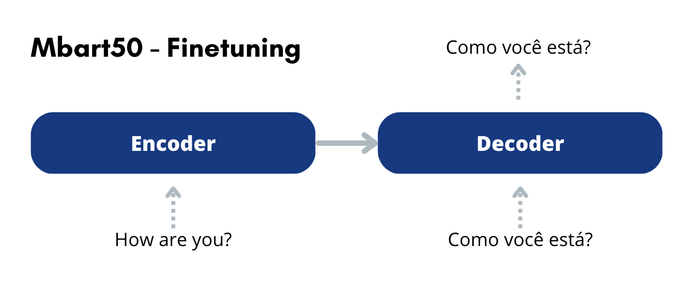
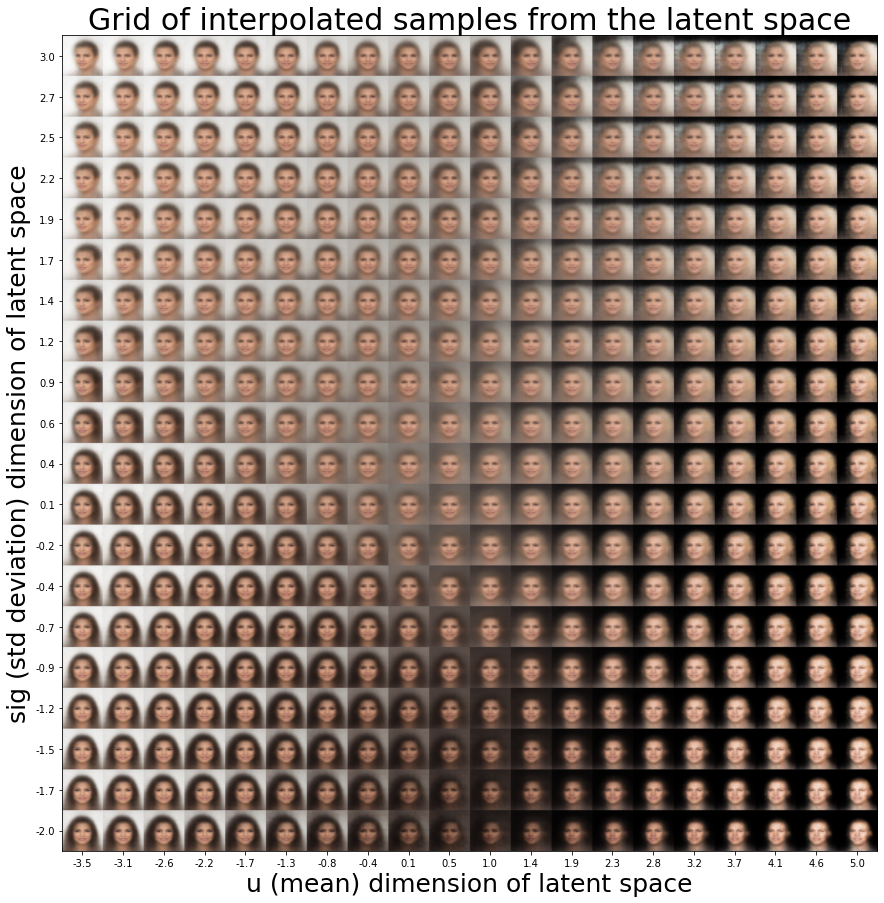
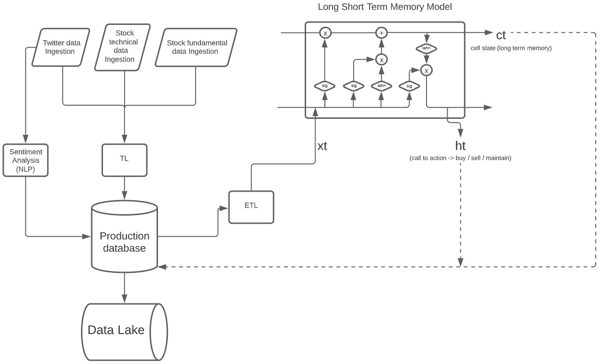

# __Brief passage through my Data / AI journey__
### João Luís Lins
 

### Finetuning of mBART50 in the task of Machine Translation - (en - pt_br) 
> Project developed envisioning participation on the WMT challenge - chat task. The final objective is to improve the current BLEU score of the previous winner. The scope consists of: filtering (Bicleaner) and cleaning 20M bilingual sentences (en-pt); selecting the most similar ones compared to a seed training corpus, provided by the WMT organization, using sentence embbeding (LABSE) and FAISS (KNN based on sentence embbeding); and finally finetuning a mBART50 on the collected data using two frameworks(native Pytorch and Hugginface). Among several used techniques, Relevant ones to cite were backtranslation, fp16, gradient accumulation and gradient checkpointing.

 

 

Project developed for the Course CS-810 - Deep Learning Competitions and Reserach during the Ms in Machine Learning at Stevens Institute of Technology.
Professor Jia Xu
 
 
 
### Attention based GRU model to 'translate' sentences using specific rules (character based) 
> This project was developed in order to achieve translation of english words by applying specific rules as described in the colab link. The use of attention in the decoder greatly reduced the convergence time of the loss and increased the overall accuracy.

 

.png)
 

Project developed for the Course CS-583 - Deep Learning during the Ms in Machine Learning at Stevens Institute of Technology.
Professor Jia Xu
 
 
 
### Bayes Variational Autoencoder 
> The objective of this project is to study the implementation of Bayes variational autoencoders. In the case here I'm using a convolutional VAE to analyze the latent space of three different datasets and try to generate new samples that resemble the original features of the training examples.

[Github repo](https://github.com/Joaoluislins/Bayes_Variational_Autoencoder)
 

 

Project made for a paper study at the MS in Machine Learning at Stevens Intitute of technology.
Course: CS 583-A
Professor: Jia Xu
 
 
 
### (In progress) Deploy of a algorithmic stock trading strategy using a deep learning model (LSTM Keras) 
*Predicting Stock's price movement.*
> The main objectives of this project are: understand advanced deep learning models inner structures; comprehend the whole cycle of the data throughout a model in production.
The deploy of the model is going to be made in AWS using terraform script and it's going to be orchestrated with Apache Airflow.
[Github repo](https://github.com/Joaoluislins/algotrader-aws-airflow)
 

 

Project built for personal motivation. Accompanied by mentors of the Data Engineering bootcamp at [How Bootcamps](https://howedu.com.br/cohort/engenharia-de-dados/?gclid=Cj0KCQiAmpyRBhC-ARIsABs2EAqENMpiYYuGn9bKLYI-btMdAS8R3be_UNzxraVEg4tDxT1Rkka8vRAaAsG5EALw_wcB).
 
 
 
### Predicting used Toyota car prices from a UK dealership store. - (Lasso, Ridge, Elastic, Stochastic GradientBoosting) 

> The objective of this study was to advise the Sales team into pricing used cars that arrive on a UK dealership store.
By analyzing the given dataset, collected from other retailers, I could:

- Infer the aspects of a car that are most relevant in predicting it's selling price.
- Create a predictive pricing model that works well within a £1500 error's limit range.
 

 

Project built as part of the Data Scientist Professional Certification, provided by [DataCamp](http://www.datacamp.com/).  
 
 
### Predicting rent prices in StreetEasy, a Real Estate marketplace. - Multiple Linear Regression  

> The objective of the project was to predict rent prices, applying Multiple Linear Regression in 14 feats, working with Python and a dataset that contains a sample of 5,000 rentals listings in Manhattan, Brooklyn, and Queens, active on StreetEasy in June 2016.

 

Project built as part of the Data Scientist Career Certification, provided by [Codecademy](http://www.codecademy.com/). \
Partnership between StreetEasy and Codecademy to provide a real business case study.

*StreetEasy is New York City's leading real estate marketplace.*
 
 

### Predicting the insurance charging cost of a US citizen. - Multiple Linear Regression // Data exploration  

> The objective of the project was to build a python algorithm to analyze the data and the influence of 14 feats on US insurance costs, no framework was given and I could choose whatever aspects I would like to focus into.
 

Codecademy project

