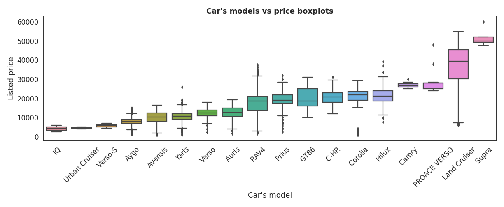

# __João Luís Lins__
Brief passage through my Data / AI journey \
 

### (In progress) Deploy of a algorithmic stock trading strategy with a deep learning model (LSTM Keras) 
*Predicting Stock's price movement.*
> The main objectives of this project are: understand advanced deep learning models inner structures; comprehend the whole cycle of the data throughout a model in production.
The deploy of the model is going to be made in AWS.
 

 

Project built by personal motivation. Accompanied by the mentors of the Data Engineering bootcamp at [How Bootcamps](https://howedu.com.br/cohort/engenharia-de-dados/?gclid=Cj0KCQiAmpyRBhC-ARIsABs2EAqENMpiYYuGn9bKLYI-btMdAS8R3be_UNzxraVEg4tDxT1Rkka8vRAaAsG5EALw_wcB).
 
 
 
### Predicting used Toyota car prices from a UK dealership store. - (Lasso, Ridge, Elastic, Stochastic GradientBoosting) 

> The objective of this study was to advise the Sales team into pricing used cars that arrive on a UK dealership store.
By analyzing the given dataset, collected from other retailers, I could:

- Infer the aspects of a car that are most relevant in predicting it's selling price.
- Create a predictive pricing model that works well within a £1500 error's limit range.
 

 

Project built as part of the Data Scientist Professional Certification, provided by [DataCamp](http://www.datacamp.com/).  
 
 
### Predicting rent prices in StreetEasy, a Real Estate marketplace. - Multiple Linear Regression  

> The objective of the project was to predict rent prices, applying Multiple Linear Regression in 14 feats, working with Python and a dataset that contains a sample of 5,000 rentals listings in Manhattan, Brooklyn, and Queens, active on StreetEasy in June 2016.

 

Project built as part of the Data Scientist Career Certification, provided by [Codecademy](http://www.codecademy.com/). \
Partnership between StreetEasy and Codecademy to provide a real business case study.

*StreetEasy is New York City's leading real estate marketplace.*
 
 

### Predicting the insurance charging cost of a US citizen. - Multiple Linear Regression // Data exploration  

> The objective of the project was to build a python algorithm to analyze the data and the influence of 14 feats on US insurance costs, no framework was given and I could choose whatever aspects I would like to focus into.
 

Codecademy project

