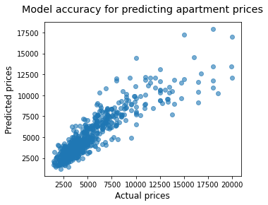

# __João Luís Lins__
Brief passage through my Data Science / MLOps journey \
 
### StreetEasy - Multiple Linear Regression  
*Predicting rent prices in StreetEasy, a Real Estate marketplace.*
 
 

> The objective of the project is to predict rent prices, applying Multiple Linear Regression in 14 feats, working with Python and a dataset that contains a sample of 5,000 rentals listings in Manhattan, Brooklyn, and Queens, active on StreetEasy in June 2016.

Project built as part of the Data Scientist Career Certification, provided by Codecademy. \
It's a partnership between StreetEasy and Codecademy to provide a real business case study.

* Codecademy is an online coding learning resource. 
* StreetEasy is New York City's leading real estate marketplace.
 
 

### US insurance costs - Multiple Linear Regression // Data exploration  
*Predicting the insurance charging cost of a US citizen.*
 

> The objective of the project was to build a python algorithm to analyze the data and the influence of 14 feats on US insurance costs, no framework was given and I could choose whatever aspects I would like to focus into.

Codecademy project

